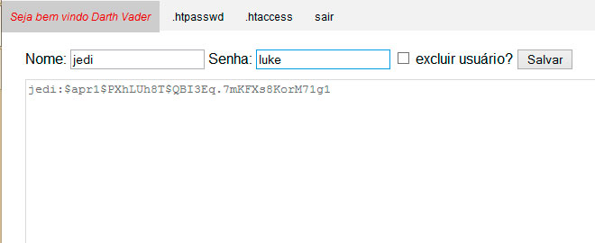
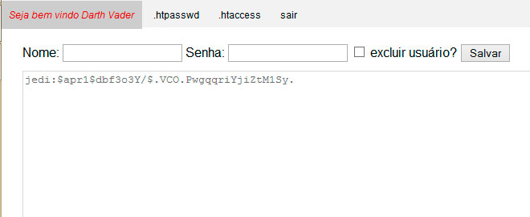

[voltar](https://github.com/gustavomathias/musicall/blob/master/documentacao/README.md)
#Alterar senha dos usuários no arquivo .htpasswd.

Na pagina de **.htpasswd**, você vai digitar o nome do usuário que deseja alterar o nome no campo referênte ao nome e no campo senha você vai digitar a nova senha que deseja para este usuário. 
O nome do usuario sem acentos e espaço no campo referente ao nome, e a senha, faça o mesmo, lembrando que não pode ter acentuação, caracteres especiais, espaço, minimo 3 caracteres e no maximo 16.

Depois de digitar as informações necessárias, clique em *salvar*. 
Após alterar a senha do usuário, será exibido abaixo dos campos, o nome do usuário com sua nova senha criptografada.

