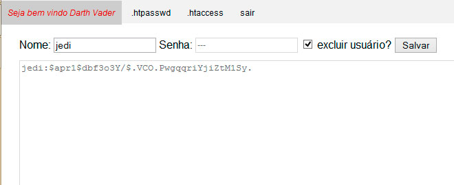

[voltar](https://github.com/gustavomathias/musicall/blob/master/documentacao/README.md)
#Excluir usuários do arquivo .htpasswd.

Para remover um usuário do arquivo **.htpasswd**, você vai digitar o nome do usuário que deseja e selecionar o box **excluir usuário?**, depois clique em salvar conforme a imagem a baixo. 

Depois de excluir, você vai reparar que o usuário que foi digitado o nome, foi removido da lista. 

*obs:* sempre deixe pelo menos um usuário na lista **.htpasswd** antes de gerar ou mesmo já gerado o arquivo **.htaccess** para que ele possa acessar a pasta e o sistema com um usuário. 
No caso de não existir um usuário ele vai aparecer a tela de login e não ai ter como fazer uma autenticação. Tendo como solução, acessar o servidor via *FTP* e excluir o arquivo **.htaccess** para poder acessar o sistema e fazer a adição de um usuário. Se você não tiver acesso ao *FTP*, entre em contato com o administrador do servidor para poder informar sobre a exclusão dos arquivos.
