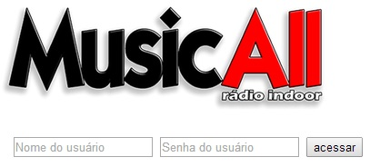

[voltar](https://github.com/gustavomathias/musicall/blob/master/documentacao/README.md)
#Tela de Acesso.

Para acessar o sistema é necessário que o usuário tenha um username e uma chave de acesso.
Digite o nome do usuário e a senha referênte a ele depois clique no botão **acessar**

--

--

*obs:* é necessário digitar mais um usuário e senha depois que você criar os arquivos .htpasswd e .htaccess no sistema.