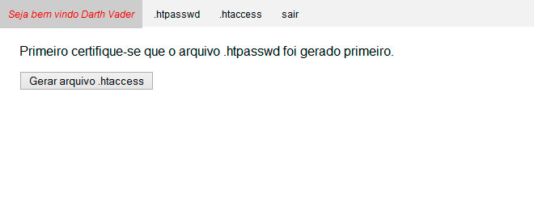
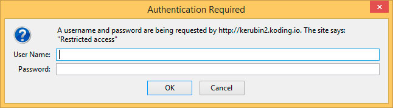

[voltar](https://github.com/gustavomathias/musicall/blob/master/guia_rapido/README.md)
#Gerar arquivo .htaccess.

Para gerar o arquivo **.htaccess**, clique no botão **Gerar aquivo .htaccess**.

Após gerar o arquivo, imediatamente vai aparecer tela de autenticação do *apache server* para validar o acesso.

