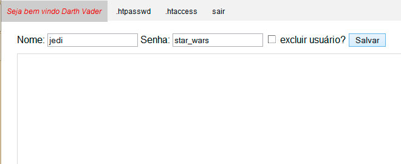
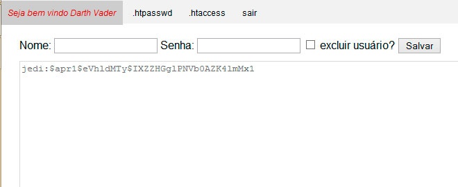

[voltar](https://github.com/gustavomathias/musicall/blob/master/documentacao/README.md)
#Adicionar usuários no arquivo .htpasswd.

Na pagina de **.htpasswd**, você vai adicionar os usuários com suas senhas, para dar permissão de acesso para cada usuário. 
Digite o nome do usuario sem acentos e espaço no campo referente ao nome, e a senha, faça o mesmo, lembrando que não pode ter acentuação, caracteres especiais, espaço, minimo 3 caracteres e no maximo 16.

Depois de digitar as informações necessárias, clique em *salvar* (no caso do o arquivo **.htpasswd** não tiver criado no diretorio, no lugar de *salvar*, vai estar escrito *criar*). 
Após adicionar um novo usuário, será exibido abaixo dos campos, os nomes dos usuários e suas senhas criptografadas.

